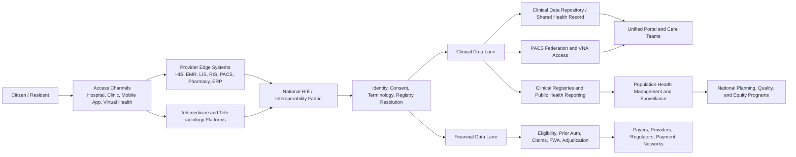
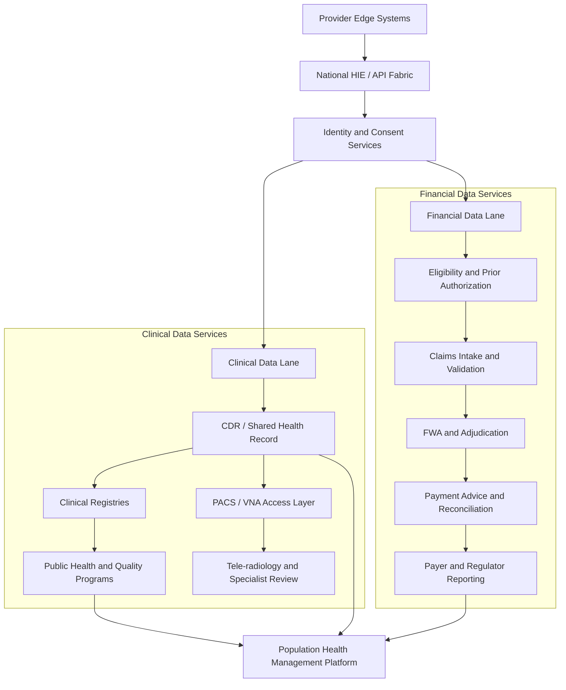
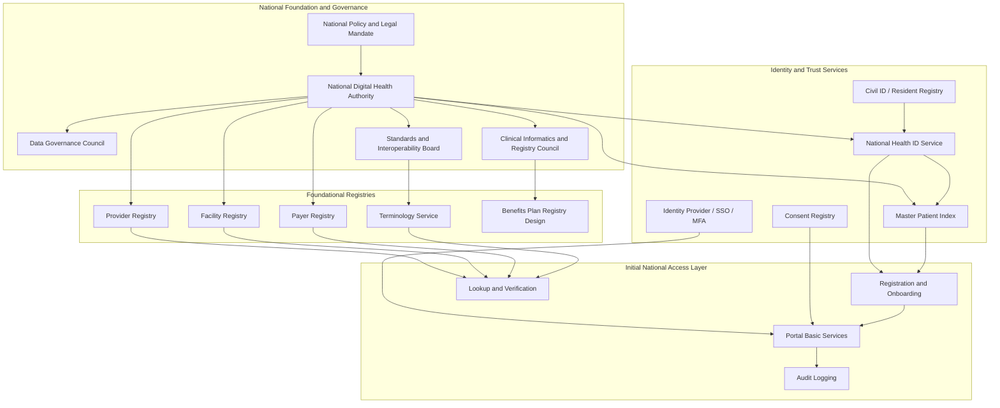
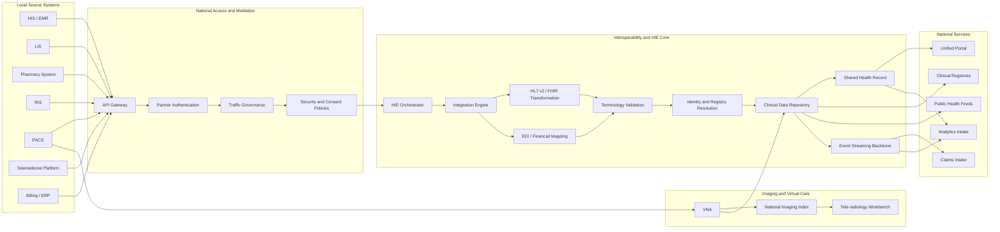
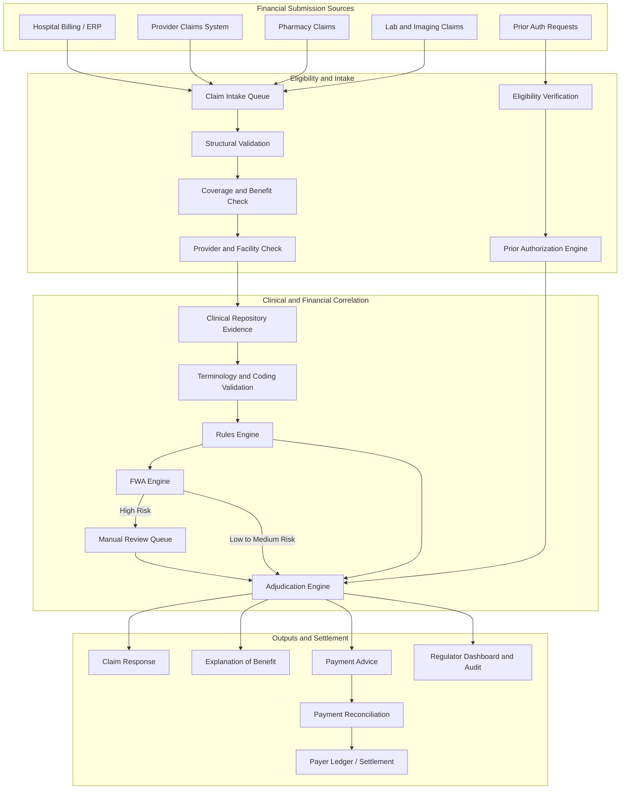
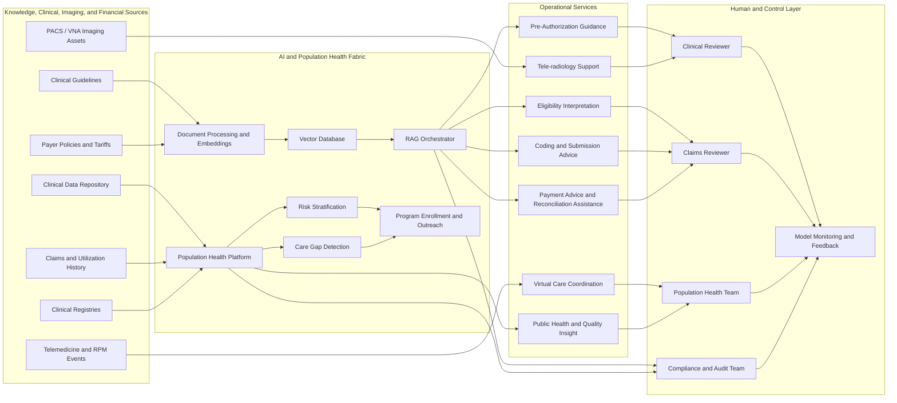

  

 

# Greenfield Country Digital Health Transformation Blueprint

This document presents a greenfield national digital health transformation blueprint for a country-wide ecosystem built around interoperable digital health services, national registries, strong governance, phased execution, and a balanced architecture for both clinical and financial data. The design aligns with current digital health transformation thinking that emphasizes sovereign architecture, open standards, reusable digital public infrastructure, and staged national rollout.[cite:17][cite:26][cite:29]

## Executive Vision

The target state is a national digital health ecosystem in which every citizen has a unique digital health identity, every provider and facility is registered, every clinical interaction is captured as part of a longitudinal record, and every financial transaction is traceable from eligibility through reimbursement. The architecture should be modular, sovereign or sovereign-ready, secure by design, and capable of scaling from foundational registries into nationwide care delivery, imaging exchange, claims automation, public health surveillance, and AI-assisted workflows.[cite:17][cite:20][cite:29]

At the national level, the ecosystem should act as a trusted digital exchange fabric connecting hospitals, clinics, laboratories, pharmacies, imaging centers, insurers, virtual health providers, public health agencies, and regulators through standard APIs and national services. Legacy standards such as HL7 v2 and X12 EDI should be transformed at the boundary layer, while the national canonical model should remain HL7 FHIR-based for long-term interoperability and extensibility.[cite:17][cite:26][cite:29]

A successful greenfield transformation should be treated as a national public digital infrastructure program rather than only an IT modernization effort. Its value comes from connecting clinical service delivery, imaging, referral workflows, entitlement verification, payment integrity, population health, and policy execution through one governed national backbone.[cite:17][cite:20][cite:27][cite:29]

## Ecosystem Topology

A complete national ecosystem needs both care-delivery systems and national shared platforms. At the edge, providers operate Hospital Information Systems, Electronic Medical Records, Laboratory Information Systems, Radiology Information Systems, PACS, pharmacy systems, ERP or billing systems, telemedicine platforms, and tele-radiology workstations. These systems feed a national Health Information Exchange where data is normalized, secured, consent-checked, and routed into clinical repositories, registries, claims systems, portals, analytics, and regulatory services.[cite:20][cite:22][cite:23][cite:29]

The national operating model should separate but coordinate two high-value data lanes:

1. **Clinical data lane**: encounters, orders, observations, medications, imaging, referrals, care plans, teleconsultations, and public health notifications.
2. **Financial data lane**: eligibility checks, prior authorization, claims, rules validation, fraud scoring, adjudication, remittance, payment advice, and reconciliation.

These lanes must meet in common services such as identity, consent, terminology, provider registries, facility registries, benefits registries, audit, and analytics. This is what allows one ecosystem to support care continuity and reimbursement integrity at the same time.[cite:17][cite:22][cite:27][cite:29]

### National Logical Flow

## Core Systems

The minimum greenfield build should include the national backbone services, but it should also explicitly incorporate the major clinical production systems that generate and consume health data. In practice, the ecosystem is not only the exchange layer; it is the combined operating model of local care systems, national platforms, imaging services, virtual care, clinical repositories, registries, and financial engines.[cite:20][cite:22][cite:23][cite:29]

### National Backbone Components

| Component | Primary Role | Example Technologies | Core FHIR Resources |
|---|---|---|---|
| Integration Engine | Normalize and transform inbound messages | Mirth Connect, Apache Camel | Bundle, MessageHeader, Encounter |
| Identity Provider and IDM Integration | Federated identity, SSO, access control | Keycloak, ForgeRock | Practitioner, Patient, Person |
| API Gateway / ESB | Secure API mediation and traffic management | Kong, Apigee, WSO2 | Endpoint, CapabilityStatement |
| HIE Orchestration Layer | National exchange, routing, brokered interoperability | HAPI FHIR, OpenHIM, custom orchestration | Bundle, Encounter, DocumentReference |
| Claim Engine | Claim ingestion and routing | Kafka, RabbitMQ, intake services | Claim, Coverage |
| Claims Rule Engine | Structural and semantic validation | Drools, Camunda DMN | Claim, ClaimResponse |
| FWA Engine | Fraud, waste, and abuse detection | Spark, MLflow, feature stores | Claim, ExplanationOfBenefit |
| Adjudication Engine | Pricing and benefit adjudication | Custom rules, BPM, actuarial modules | ClaimResponse, ExplanationOfBenefit |
| Unified Portal | Multi-tenant access for patients, providers, payers, regulators | React, Angular, Keycloak front ends | Patient, Coverage, Organization |
| National Terminology Service | Code validation and mappings | Ontoserver, HAPI FHIR Terminology | CodeSystem, ValueSet, ConceptMap |
| National Beneficiary Registry | National patient master index | OpenEMPI, HAPI FHIR | Patient, Person, RelatedPerson |
| National Insurance Benefits Plan Registry | Plans, entitlements, coverage rules | PostgreSQL, FHIR services | InsurancePlan, Coverage |
| RAG-Based AI Engine | Guidance and retrieval-assisted assistance | pgvector, Weaviate, LLM orchestration | Claim, CoverageEligibilityRequest |
| Hybrid Persistence Layer | Structured, document, and vector storage | PostgreSQL, MongoDB, pgvector | All persisted FHIR resources |

### Clinical Production Systems

| System | National Role | Key Data Outputs | Notes |
|---|---|---|---|
| Hospital Information System (HIS) | Operational backbone for hospital workflows | ADT, orders, billing events, discharge data | Usually the main feeder into national exchange.[cite:20] |
| Electronic Medical Record / EHR | Source of longitudinal clinical documentation | Diagnoses, observations, medications, care plans | Should connect through national FHIR profiles.[cite:17][cite:29] |
| Laboratory Information System (LIS) | Laboratory workflow and result reporting | Orders, specimens, results, microbiology | Key for both care and surveillance.[cite:20][cite:22] |
| Radiology Information System (RIS) | Imaging workflow and scheduling | Imaging orders, reports, worklists | Core input into PACS and tele-radiology.[cite:20][cite:23] |
| PACS | Acquisition and retrieval of imaging studies | DICOM objects, reports, study metadata | Part of the broader imaging ecosystem.[cite:23] |
| Vendor Neutral Archive (VNA) | Long-term, cross-vendor imaging archive | Indexed images and imaging-related metadata | Important to reduce imaging silos and enable reuse.[cite:22][cite:23] |
| Pharmacy Information System | Medication dispensing and inventory | Dispensing events, formulary checks | Supports e-prescribing and reimbursement controls.[cite:20] |
| Telemedicine Platform | Virtual consultation and remote care delivery | Teleconsultation records, scheduling, notes | Should feed the same clinical repository as in-person care. |
| Tele-radiology Platform | Remote image interpretation and specialist coverage | Reading assignments, reports, second opinions | Extends specialist capacity across regions.[cite:23] |
| Virtual Health Platform | Broader digital front door for remote care | Messaging, RPM, education, care navigation | Supports access and patient engagement.[cite:18][cite:24][cite:27] |

### Clinical Data Platforms

| Platform | Purpose | Distinguishing Role |
|---|---|---|
| Clinical Data Repository (CDR) | Consolidates clinical data from multiple sources into a unified patient view | Optimized for patient-centric retrieval across many clinical sources.[cite:22][cite:28][cite:31] |
| Shared Health Record / Clinical Repository | National or regional longitudinal view of the patient | Often implemented on top of CDR and HIE services.[cite:17][cite:22][cite:29] |
| Clinical Registries | Structured collections for defined patient groups, diseases, procedures, or outcomes | Narrower and more purpose-specific than a broad repository.[cite:19][cite:25] |
| Population Health Platform | Stratification, care gaps, cohort management, and intervention measurement | Uses combined clinical and financial data to improve outcomes and cost performance.[cite:18][cite:27][cite:30] |

### Expanded Component Roles

Each component should be designed as an independently scalable service with clear contracts and shared governance. In a greenfield context, this reduces vendor lock-in and allows the country to phase implementations by policy urgency, transaction volume, institutional readiness, and clinical demand rather than by one procurement timeline.[cite:17][cite:26][cite:29]

- **HIS and EMR stack**: captures encounters, admissions, discharges, orders, clinical notes, and operational events at provider level.
- **HIE**: acts as the trusted interchange and orchestration layer for national data movement and service invocation.
- **PACS, RIS, and VNA**: create the imaging backbone for storage, retrieval, workflow, and cross-enterprise access to diagnostic images.[cite:22][cite:23]
- **Telemedicine, virtual health, and tele-radiology**: extend access, specialist reach, and continuity of care across rural, urban, and home settings.[cite:18][cite:24][cite:27]
- **Clinical Data Repository and Shared Health Record**: provide the patient-centric clinical memory of the ecosystem, aggregating information from many care settings.[cite:22][cite:28][cite:31]
- **Clinical registries**: support specific outcomes management, surveillance, clinical quality programs, and research-oriented or policy-oriented tracking.[cite:19][cite:25]
- **Claims and financial engines**: make benefit policy executable and measurable from submission through payment.[cite:27][cite:29]
- **Population health platform**: translates combined clinical, utilization, claims, and social context into care management and public health action.[cite:18][cite:27][cite:30]

## National Registries

A sustainable national transformation depends on authoritative registries that anchor identity, entitlements, reference data, imaging governance, public health visibility, and trust across the ecosystem. These registries should be governed nationally, exposed through secure APIs, and updated through clear stewardship workflows.[cite:17][cite:25][cite:29]

### Mandatory Registries

- **National Health ID / Beneficiary Registry**: citizen and resident health identity, demographic golden record, deduplication, and survivorship logic.
- **Master Patient Index**: cross-system patient matching and identity resolution.
- **Provider Registry**: licensed clinicians, specialties, privileges, and status.
- **Facility Registry**: hospitals, clinics, labs, pharmacies, imaging centers, and public health sites.
- **Payer Registry**: insurers, administrators, and funding entities.
- **Benefits Plan Registry**: benefit structures, exclusions, co-pay rules, and prior authorization requirements.
- **Terminology Registry**: national code systems, local mappings, and approved value sets.
- **Drug and Formulary Registry**: approved medicines, packages, reimbursement classes, and restrictions.
- **Laboratory Catalog Registry**: tests, panels, specimen rules, and mappings.
- **Imaging Registry / Study Index**: imaging network participants, modality references, study discovery controls, and retention policies.
- **Device Registry**: medical devices, implants, and unique device identifiers.
- **Clinical Registry Set**: cancer registry, cardiac registry, stroke registry, trauma registry, rare disease registry, maternal-child registry, dialysis registry, transplant registry, and outcome registries for national programs.[cite:19][cite:25]
- **Public Health Registry Set**: immunization, disease surveillance, maternal-child health, and mortality reporting.
- **Consent Registry**: patient consent directives, sharing preferences, and legal bases for access.
- **Care Program Registry**: population health cohorts, chronic disease programs, and case-management enrollment.[cite:18][cite:25][cite:30]

### Registry Governance Expectations

Each registry should have a named steward, a legal basis, a defined source of truth, and operational controls for update frequency, versioning, quality review, dispute management, and archival retention. Without these controls, registry fragmentation quickly becomes the hidden cause of exchange failure, claims rejection, imaging mismatch, and mistrust across the ecosystem.[cite:17][cite:19][cite:29]

| Registry | Stewardship Focus | Key Control Questions |
|---|---|---|
| Beneficiary Registry | Identity quality and deduplication | Who can create, merge, split, or retire identities? |
| Provider Registry | Licensure and role validity | How are specialties, status, and practice privileges maintained? |
| Facility Registry | Legal operating status and location | Which authority certifies service availability and ownership? |
| Benefits Plan Registry | Entitlement and payment logic | Who approves plan changes and effective dates? |
| Terminology Registry | Semantic consistency | How are national and local code mappings versioned? |
| Imaging Registry | Study discoverability and retention rules | How are image ownership, retention, and cross-site retrieval managed? |
| Clinical Registries | Program quality and outcome measurement | What are the cohort definition, minimum data set, and reporting cadence? |
| Consent Registry | Patient rights and lawful access | How are consent grants, revocations, and exceptions recorded? |

## Clinical and Financial Data Architecture

A country-wide ecosystem should deliberately model clinical and financial data as linked but distinct national assets. Clinical data supports diagnosis, treatment, safety, continuity, quality, surveillance, and longitudinal care. Financial data supports entitlement control, utilization management, reimbursement, fraud detection, actuarial insight, and policy sustainability.[cite:18][cite:22][cite:27][cite:29]

### Clinical Data Domain

The clinical data domain should include person identity, encounters, episodes of care, problems and diagnoses, allergies, medications, orders, results, procedures, documents, images, teleconsultation notes, care plans, referral events, and public health notifications. These data should flow through the HIE into a clinical data repository or shared health record, while selected subsets feed disease-specific and program-specific clinical registries.[cite:19][cite:22][cite:25][cite:31]

### Financial Data Domain

The financial data domain should include eligibility requests, benefits verification, prior authorizations, claims, pre-adjudication edits, provider contracts, tariffs, fraud signals, adjudication outcomes, remittance, payment advice, and reconciliation artifacts. These data should remain linked to the clinical context through encounter, provider, member, and service references so utilization and payment integrity can be assessed together.[cite:27][cite:29]

### Dual-Lane Architecture

## Governance Model

A national digital health program should be governed through a formal institutional model rather than through project-level committees alone. Governance must define who owns standards, who certifies participants, who regulates data use, who approves clinical repository and registry policies, and who resolves operational disputes across providers, payers, and regulators.[cite:17][cite:25][cite:29]

### Governance Bodies

- **National Digital Health Authority**: owns policy, architecture, standards, certification, and platform stewardship.
- **Health Data Governance Council**: defines data ownership, access policies, consent models, retention rules, and secondary use policies.
- **Interoperability and Standards Board**: maintains FHIR implementation guides, messaging specifications, image exchange profiles, and conformance requirements.
- **Clinical Informatics and Registry Council**: defines national minimum data sets, registry inclusion rules, data quality controls, and longitudinal record policies.
- **Privacy and Ethics Committee**: oversees patient rights, AI safeguards, data sharing approvals, and high-risk use cases.
- **Cybersecurity Operations Council**: enforces zero-trust security, incident response, vulnerability management, and resilience testing.
- **Provider and Payer Advisory Forum**: coordinates adoption, operational alignment, and phased onboarding.[cite:17][cite:25][cite:29]

### Governance Policies

- Data classification and residency policy.
- Consent and access control policy.
- National interoperability policy based on HL7 FHIR.
- National imaging interoperability and retention policy for PACS and VNA ecosystems.
- Clinical repository and shared record governance policy.
- Clinical registry governance and minimum data set policy.
- Population health analytics and secondary use policy.
- Terminology governance and code stewardship policy.
- Certification policy for local systems connecting to the national network.
- Audit, logging, and breach notification policy.
- AI assurance policy for advisory and automated decision support use cases.[cite:17][cite:23][cite:25][cite:29]

## Population Health Management Strategy

Population health management should be treated as a national strategy layer, not just a dashboard project. Effective PHM platforms aggregate data from EHRs, labs, HIEs, claims systems, pharmacy, and patient engagement channels; stratify risk; identify care gaps; support care management workflows; and track outcomes across cost, quality, access, and equity dimensions.[cite:18][cite:24][cite:27][cite:30]

### PHM Core Capabilities

- Comprehensive data aggregation across clinical, claims, pharmacy, utilization, and patient-generated sources.[cite:18][cite:27]
- Risk stratification for chronic disease, rising-risk cohorts, avoidable utilization, and equity gaps.[cite:18][cite:27][cite:30]
- Care gap detection for prevention, chronic disease control, follow-up, and care transitions.[cite:18][cite:24][cite:27]
- Care management workflows for case managers, nurses, coordinators, and social care linkages.[cite:18][cite:27][cite:30]
- Patient engagement through digital outreach, reminders, messaging, remote monitoring, and education.[cite:18][cite:24]
- Outcomes and contract performance dashboards for providers, payers, and regulators.[cite:24][cite:27][cite:30]

### PHM Strategic Operating Model

The PHM platform should consume both clinical and financial data so the country can move beyond retrospective reporting into actionable cohort management. Clinical indicators identify disease burden and care need, while claims and utilization indicators reveal cost pressure, leakage, and service variation; together they support targeted interventions and measurable return on investment.[cite:18][cite:27][cite:30]

## Phased Delivery Roadmap

A four-phase delivery model reduces transformation risk by establishing trust and core infrastructure first, then layering transactions, financial logic, imaging, repositories, virtual care, and intelligent automation over time.[cite:17][cite:26][cite:29]

### Phase 1 — Foundation and Identity

Phase 1 establishes the minimum sovereign backbone required for any national digital health program: trusted identity, foundational registries, legal mandate, and the first version of the unified portal.[cite:17][cite:29]

**Core deliverables**

- National Digital Health Authority and legal framework.
- National Health ID and Master Patient Index.
- Provider, Facility, and Payer Registries.
- Identity Provider, SSO, and access management.
- Terminology governance startup and first national code services.
- Basic unified portal for registration, lookup, and onboarding.
- Policy foundation for clinical repository, imaging exchange, and registry stewardship.[cite:17][cite:25][cite:29]

**Critical dependencies**

- National civil identity linkage or resident identity source.
- Health-sector legal authority for digital records and data exchange.
- Early operating model for stewardship and support.

**Key risk mitigations**

- Start with a limited number of public facilities and one pilot region.
- Run human verification workflows for identity matching during the first rollout.
- Separate legal go-live from nationwide operational go-live.
- Define minimum data sets and retention policies before repository build-out.[cite:17][cite:19][cite:29]

### Phase 2 — Transactional Core, HIE, and Clinical Exchange

Phase 2 builds the operational exchange layer that allows local systems to connect safely and consistently to national services. This is also the phase where HIS, EHR, LIS, RIS, PACS, telemedicine, and pharmacy platforms become part of one functioning clinical ecosystem through the HIE.[cite:20][cite:23][cite:29]

**Core deliverables**

- National API Gateway and service mediation.
- HIE and interoperability orchestration layer.
- Integration engine for HL7 v2, X12 EDI, DICOM-related workflows, and local format transformation.
- Canonical FHIR server and profile repository.
- Event streaming backbone for transactional processing.
- Consent services and secure API access patterns.
- Initial onboarding of HIS, EHR, lab, pharmacy, RIS, PACS, and telemedicine systems.
- First release of the clinical data repository and shared health record.[cite:20][cite:22][cite:23][cite:29]

**Critical dependencies**

- Stable registries from Phase 1.
- National implementation guides and onboarding standards.
- Technical support model for local vendor integration.
- Imaging exchange rules and data retention policy.

**Key risk mitigations**

- Certify participant systems before production exchange.
- Roll out in waves by care setting and geography.
- Use canonical FHIR profiles to prevent custom fragmentation.
- Keep image archival strategy separate from viewer strategy so PACS replacement does not break continuity.[cite:22][cite:23][cite:29]

### Phase 3 — Financial and Administrative Intelligence

Phase 3 adds claims processing, benefits validation, prior authorization, fraud controls, adjudication logic, and regulatory transparency across financial transactions. This phase is where clinical evidence and financial controls become tightly linked, because claims decisions should be explainable in relation to coverage, coded services, and care context.[cite:27][cite:29]

**Core deliverables**

- Claim ingestion and queueing services.
- Structural and business rules engine.
- National Benefits Plan Registry.
- Eligibility and prior authorization services.
- Fraud, Waste, and Abuse analytics.
- Adjudication engine and remittance outputs.
- Regulator dashboards and operational audit services.
- Financial reconciliation and payment advice services.[cite:27][cite:29]

**Critical dependencies**

- Reliable eligibility and coverage master data.
- National pricing rules and contract logic.
- Payer participation and settlement process alignment.
- Clean linkage between encounter, provider, member, and claim identifiers.

**Key risk mitigations**

- Begin with advisory-mode fraud scoring before auto-actions.
- Run shadow adjudication against manual processes before cutover.
- Enforce full auditability for every automated rule outcome.
- Keep clinical evidence attachment strategy standardized through HIE and repository services.[cite:22][cite:27][cite:29]

### Phase 4 — Imaging, Virtual Health, Population Health, and Intelligent Automation

Phase 4 turns the ecosystem into an advanced service environment by expanding imaging federation, virtual care, clinical registries, population health management, and retrieval-augmented AI. The AI layer should augment deterministic workflows rather than replace them, and the PHM layer should operationalize both clinical and financial insight into targeted interventions.[cite:18][cite:22][cite:25][cite:27][cite:29]

**Core deliverables**

- Vectorized policy and guideline knowledge base.
- RAG assistant for provider, payer, and regulator workflows.
- Expanded VNA access and tele-radiology service patterns.
- Mature telemedicine and virtual health integration with national records.
- National clinical registry program with disease and outcome registries.
- Population health management platform with stratification, care-gap detection, and outreach.
- AI-assisted pre-authorization, eligibility interpretation, coding support, payment advice explanation, and reconciliation assistance.[cite:18][cite:22][cite:25][cite:27]

**Critical dependencies**

- Sufficient historical transactions and curated policy content.
- AI governance controls, model monitoring, and human oversight.
- Strong data quality across prior phases.
- Reliable multi-source aggregation from clinical and claims systems.

**Key risk mitigations**

- Keep AI advisory first, with humans approving high-impact actions.
- Log every retrieval, prompt context, and recommendation outcome.
- Restrict AI from bypassing deterministic claims or identity controls.
- Govern disease registries with explicit cohort definitions and minimum data sets.
- Keep PHM tied to operational care management, not only reporting dashboards.[cite:18][cite:25][cite:27][cite:30]

## Security and HA Strategy

A national platform should use zero-trust patterns end to end, including mutual TLS between services, strong API authentication, role-based and attribute-based access control, and continuous security monitoring. Sensitive data should be encrypted in transit and at rest, with centralized key management and detailed audit logging for all access, change, and disclosure events.[cite:17][cite:23][cite:29]

For resilience, the platform should be designed for multi-region deployment with clearly defined data residency boundaries, hot or warm disaster recovery patterns, tested failover procedures, and service-level objectives for recovery time and recovery point targets. High-volume national services such as identity, HIE, FHIR APIs, clinical repositories, imaging indexes, and claims services should be stateless where possible and backed by replicated persistence tiers across structured, document, imaging, and vector data stores.[cite:17][cite:22][cite:23][cite:29]

### Security Controls by Layer

| Layer | Priority Controls |
|---|---|
| User Access | MFA, adaptive access, privileged access management, session monitoring |
| API Layer | OAuth2/OIDC, mTLS, token introspection, throttling, schema validation |
| Service-to-Service | Service mesh, certificate rotation, workload identity, policy enforcement |
| Clinical Data Layer | Encryption at rest, patient consent enforcement, break-glass logging, repository segmentation |
| Imaging Layer | DICOM security controls, viewer isolation, archive retention controls, image-access audit trails |
| Financial Layer | Nonrepudiation, reconciliation controls, payment workflow audit, tariff version control |
| Operations | SIEM, SOC monitoring, vulnerability scanning, penetration testing, incident playbooks |
| Resilience | Multi-region design, backup validation, failover drills, dependency mapping |

## Recommended Transformation Sequence

A greenfield country should avoid launching all domains at once. The most effective path is to first establish identity, trust, and governance; then activate HIE and clinical exchange; then digitize clinical repository, imaging, and financial flows; and only then expand into population health and advanced intelligence.[cite:17][cite:20][cite:22][cite:27][cite:29]

This sequence creates early legitimacy, reduces architectural rework, and ensures that later AI, registry, imaging, and PHM capabilities are built on governed national data rather than disconnected pilots. It also ensures that both clinical and financial data mature together, which is essential for quality, access, sustainability, and national planning.[cite:18][cite:25][cite:27][cite:29]

## Implementation Notes for National Programs

The blueprint should be delivered through a product operating model with national architecture ownership, phased procurement, conformance testing, and a service management function that survives beyond implementation projects. Procurement lots should be aligned to capabilities such as identity, HIE, clinical repository, imaging, registries, claims, portal, telehealth, and analytics so the country can preserve modularity while still enforcing one national target architecture.[cite:17][cite:23][cite:29]

The strongest early indicators of success are not only software go-live milestones but measurable trust and outcome indicators: identity match quality, provider onboarding speed, API conformance rates, image retrieval interoperability, telemedicine utilization, claims turnaround time, payment accuracy, care-gap closure, and regulator visibility into operational performance. These measures create a practical bridge between digital transformation goals and health system accountability.[cite:18][cite:24][cite:27][cite:29]

---

 

  
    
  © 2026 <strong>AINQA Healthcare</strong>. All rights reserved. 
  This document is confidential and intended solely for authorised use. Reproduction or distribution without prior written consent of AINQA Healthcare is strictly prohibited.

